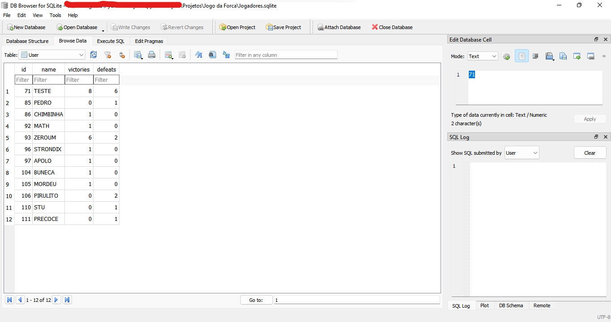

<h1 align="center"> Jogo da Forca </h1>

<h2 align="center"> Jogo da forca utilizando Python, SQL e JSON, com implementação de níveis de dificuldade. </h2>

<h3> :arrow_forward: Status do Projeto: </h3> :white_check_mark: Concluído :white_check_mark: 

<h3> :hammer: Tecnologias do Projeto: </h3>

- `Python`
- `SQL`
- `JSON`

<h3>:warning: Ferramentas Necessárias: </h3>

- `SQLite`
- `IDE qualquer (Pycharm, Atom, VS Code, etc)`

<h3>:books: Bibliotecas utilizadas: </h3>

- `json`
- `random`
- `sqlite3`

 Nota: Certifique-se de ter todas elas vinculadas à sua IDE. 

<h3>:clipboard: Descrição do Projeto: </h3>

Nesse projeto foi desenvolvido o tradicional jogo da forca, no qual o usuário, inicialmente, digita seu "nickname", depois, escolhe um nível de dificuldade (fácil, médio ou difícil), e, por fim, o jogo se inicia. O objetivo do jogo consiste no usuário advinhar a palavra, a qual é escolhida aleatoriamente a partir de um arquivo JSON contendo palavras de determinados temas e subtemas, a partir da escolha de letras do alfabeto. Caso ele acerte todas as letras sem atingir o número limite de letras erradas, ele vence. Ao final do jogo, o desempenho do usuário é salvo no banco de dados (adiciona-se uma vitória, caso ele vença; uma derrota é adicionada caso ele perca), o qual pode ser consultado toda vez que um novo jogo se inicia na opção "2 - CONSULTAR RANKING". Em relação aos modos de jogo, no nível fácil, o jogador terá duas dicas: uma sobre o tema e outra sobre o "subtema". Por exemplo, tema carro e subtema modelo. 
No modo médio, o jogador terá apenas uma dica, referente ao tema, deixando oculto qual será o subtema. Por exemplo, tema carro, podendo o subtema ser modelo, marca, etc. No difícil, o usuário não receberá nenhuma dica e terá que advinhar a palavra sem saber o tema e o subtema nos quais ela se encaixa.

 A imagem acima contém um exemplo de ranking de jogo ordenado pela taxa de vitórias de cada jogador em ordem decrescente, a partir de dados de partidas jogadas por colegas.

 A imagem acima contém o banco de dados SQLite o qual é consultado toda vez que o usuário solicita durante o jogo, e é atualizado a cada partida. Vale ressaltar que, por se tratar de um banco de dados local, cada pessoa que for utilizar esse código terá um banco de dados distinto, que vem inicialmente vazio até que o primeiro usuário seja cadastrado.

 Por fim, é válido ressaltar que o arquivo JSON contendo as palavras que irão compor o jogo pode ser alterado, adicionando-se novos temas, subtemas e palavras, seguindo o padrão já deixado. Todavia, palavras com acento ou caractere especial (hífen, espaço, etc) não funcionarão nesse jogo, sendo o maior o objetivo do mesmo implementar os níveis de dificuldade de acordo com os gostos de cada usuário e, paralelamente, salvar as informações de cada um em um banco de dados a cada partida utilizando Python e SQL.

